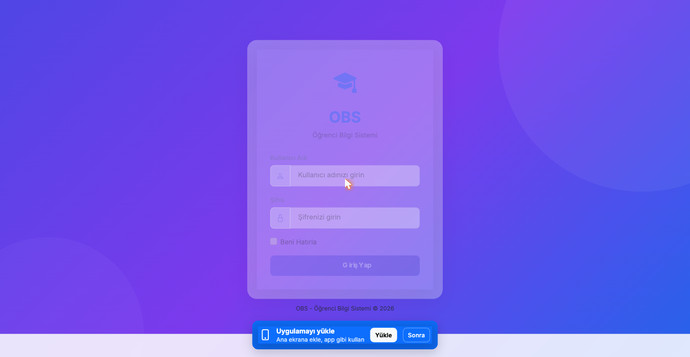
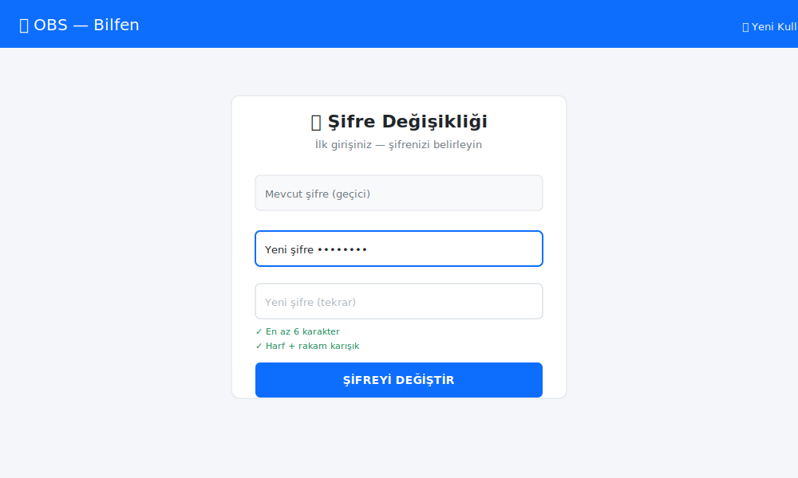
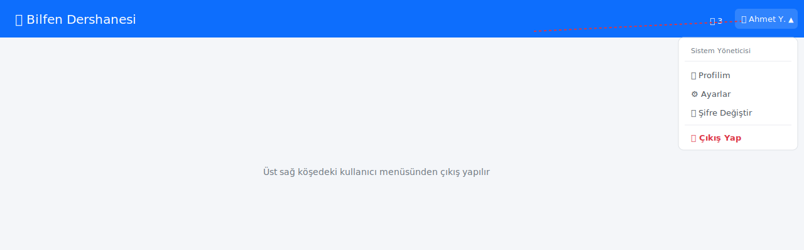

# 1. Sisteme Giriş

[← İçindekiler](00-index.md)

## 1.1. Adres ve giriş ekranı

Tarayıcıda dershanenizin OBS adresini açın. Tipik yapı:

```
https://<dershane-slug>.obs.akkayasoft.com/auth/giris
```

Örnek: `https://bilfen.obs.akkayasoft.com/auth/giris`



## 1.2. Giriş bilgileriyle oturum açma

1. **Kullanıcı Adı** kutusuna size verilen kullanıcı adını yazın
2. **Şifre** kutusuna şifrenizi yazın
3. **Giriş Yap** butonuna basın

> 💡 **Şifrenizi unutursanız** sistem yöneticinizle iletişime geçin —
> kullanıcı yönetimi sayfasından sıfırlayabilir.

## 1.3. İlk girişte şifre değiştirme

Sistem yöneticinizin oluşturduğu geçici şifreyle ilk girişinizde
sistem sizi şifre değişikliği sayfasına yönlendirir.



- Yeni şifre en az **6 karakter** olmalı
- Şifrenizi kimseyle paylaşmayın

## 1.4. Roller ve yetki seviyeleri

| Rol | Yapabildikleri |
|---|---|
| **Sistem Yöneticisi** | Tüm modüller, ayarlar, yedekleme, kullanıcı yönetimi |
| **Yönetici** | Sistem Yöneticisi ile aynı (eşit yetki) |
| **Öğretmen** | Devamsızlık, not, ödev, karne, kendi öğrencileri |
| **Muhasebeci** | Muhasebe, ödeme, tahsilat, kayıt |
| **Veli** | Sadece kendi çocuğunun bilgileri |
| **Öğrenci** | Sadece kendi notları, ödevleri |

> ⚠️ Sürücü kursu kurum tipinde **Muhasebeci salt görüntüleme**
> modunda çalışır — yazma işlemleri yöneticilere aittir.

## 1.5. Çıkış yapma

Sağ üst köşede **adınızın** yanındaki açılır menüden **Çıkış Yap**.



---

[← İçindekiler](00-index.md) · [Sonraki: Anasayfa →](02-anasayfa.md)
