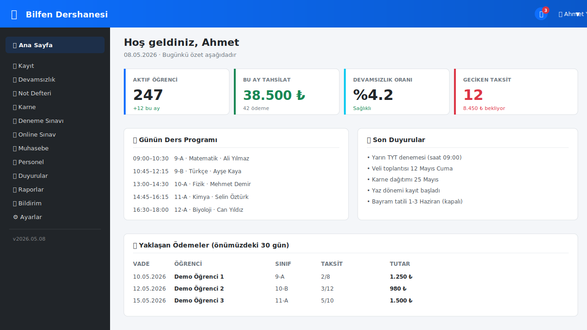
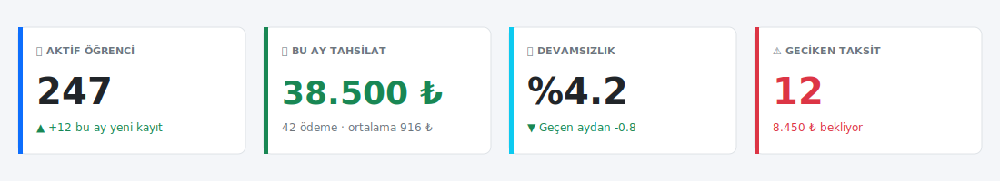
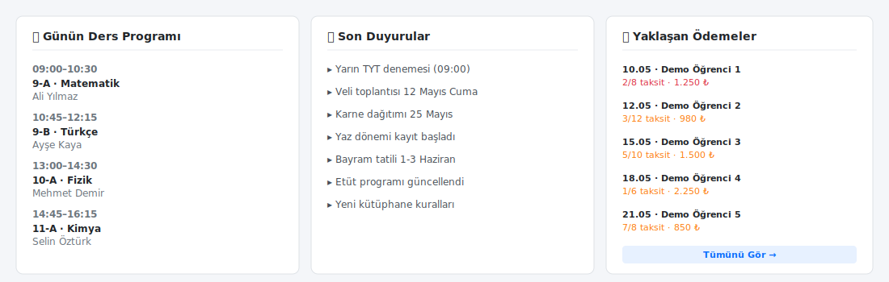
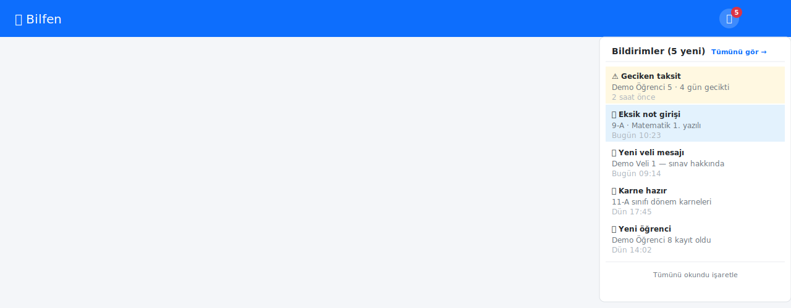
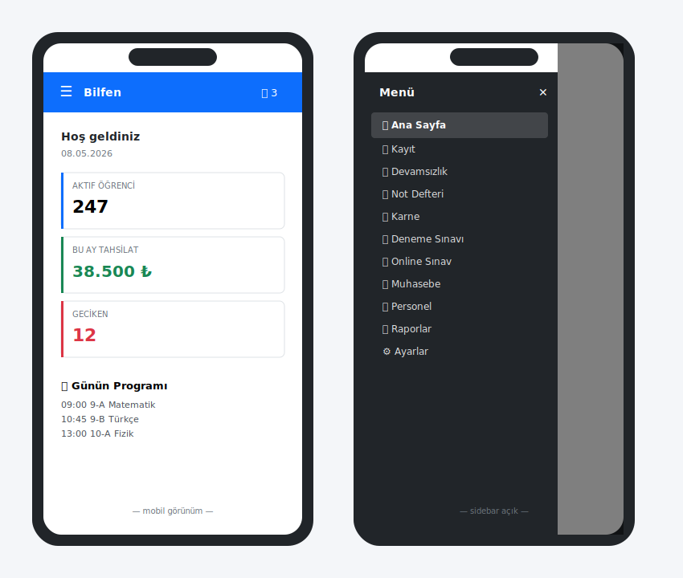

# 2. Anasayfa (Dashboard)

[← İçindekiler](00-index.md) · [← Önceki](01-giris.md)

Giriş yaptıktan sonra ilk açılan sayfa. Dershanenizin günlük tablosu
buradadır.

## 2.1. Üst banner ve sol menü

- **Üst banner (mavi)**: dershanenizin adı + bildirim çanı + kullanıcı menüsü
- **Sol sidebar**: tüm modüllerin menüsü (rol bazlı filtrelenmiş)
- **Sağ ana alan**: aktif sayfanın içeriği

## 2.2. KPI Kartları

Sayfanın üstünde 4 sayısal özet kartı:

| Kart | Anlamı |
|---|---|
| **Aktif Öğrenci** | Sistemde kayıtlı, aktif durumda olan öğrenci sayısı |
| **Bu Ay Tahsilat** | İçinde bulunulan ayın toplam ödeme tahsilatı |
| **Devamsızlık Oranı** | Bu ayki yoklama bazlı oran (%) |
| **Geciken Taksit** | Vadesi geçmiş ödenmemiş taksit sayısı |

## 2.3. Hızlı Erişim Bölümleri

KPI'ların altında:
- **Günün Ders Programı**: bugün okul saatlerinde hangi ders, hangi sınıf, hangi öğretmen
- **Son Duyurular**: yeni eklenen duyuruların özet listesi
- **Yaklaşan Ödemeler**: önümüzdeki 30 günde vadesi gelen taksitler

## 2.4. Bildirim Çanı

Sağ üstteki 🔔 ikonu yanındaki kırmızı sayı, **okunmamış**
bildirim adedidir. Tıklayınca açılan listede:
- Yarın vadesi gelen taksitler
- Eksik not girişleri
- Yeni veli mesajları
- Sistem duyuruları

> Detaylı kullanım için [Bölüm 9 — Bildirimler](09-bildirim.md).

## 2.5. Mobil görünüm

Telefonda sol menü otomatik gizlenir; sol üstteki ☰ butonuyla açılır.

---

[← İçindekiler](00-index.md) · [← Önceki](01-giris.md) · [Sonraki: Öğrenci Kaydı →](03-ogrenci-kaydi.md)
