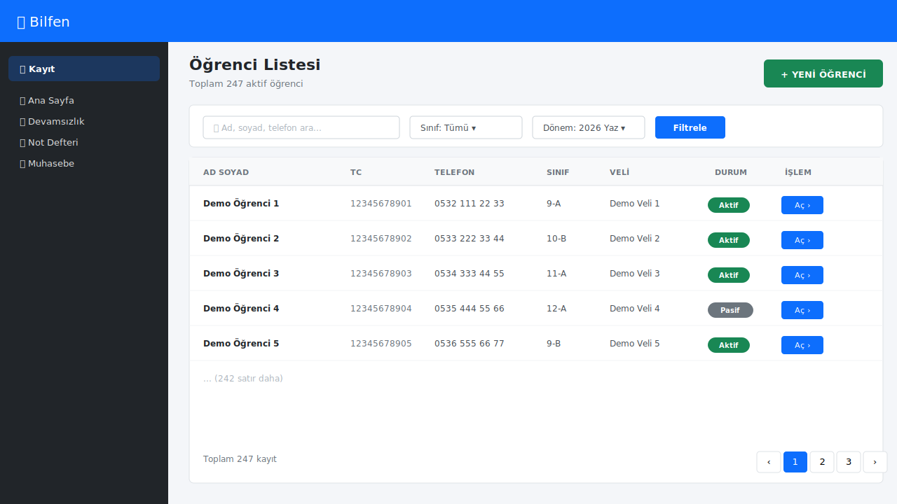
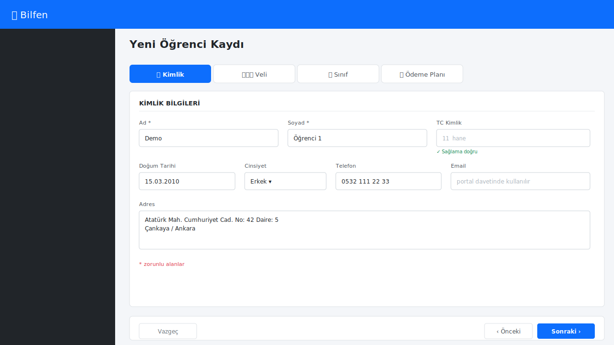
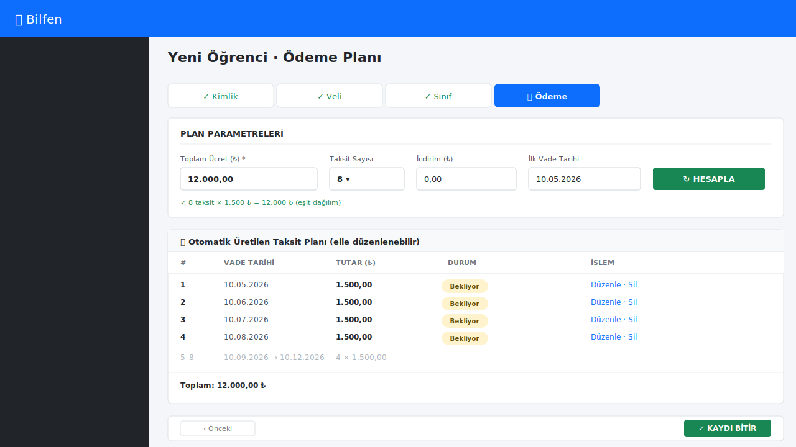
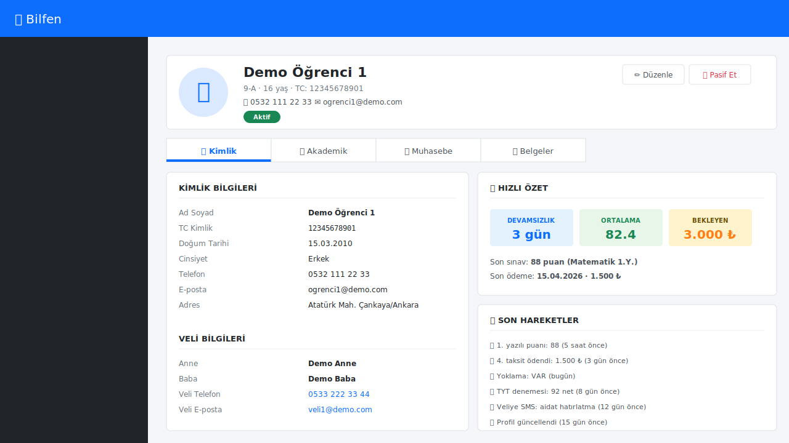
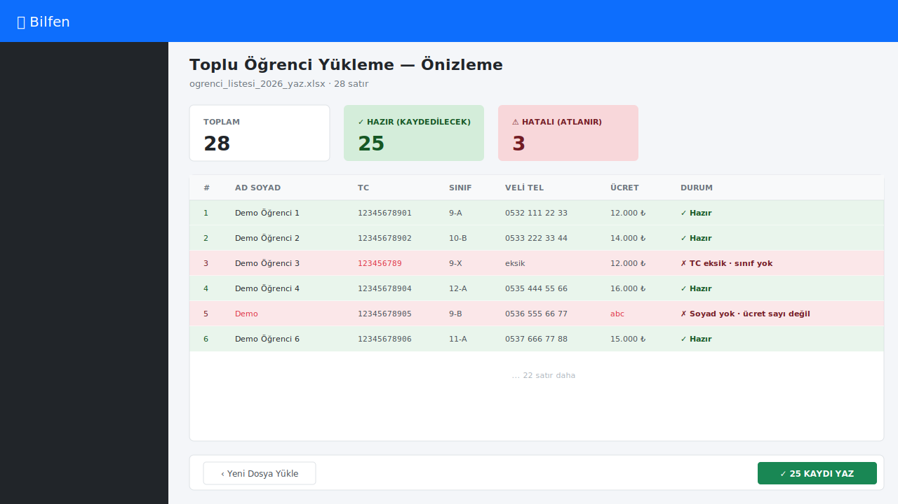

# 3. Öğrenci Kaydı

[← İçindekiler](00-index.md) · [← Önceki](02-anasayfa.md)

## 3.1. Öğrenci listesine erişim

Sol menüden **Kayıt Yönetimi → Öğrenci Listesi**.

Tabloda:
- Ad-soyad, sınıf, telefon, kayıt durumu
- Sağ üstte filtre kutusu (sınıf, dönem, ad arama)
- Her satırda "Aç" / "Düzenle" butonları

## 3.2. Yeni öğrenci ekleme

Listede sağ üst yeşil **"Yeni Öğrenci"** butonuna basın.

### 3.2.1. Kimlik bilgileri

| Alan | Zorunlu | Notlar |
|---|---|---|
| Ad | ✅ | |
| Soyad | ✅ | |
| TC Kimlik | ⚠️ | 11 hane, sağlama doğrulanır |
| Doğum Tarihi | | |
| Cinsiyet | | erkek / kız |
| Telefon | | |
| Email | | Veli portal davetinde kullanılır |

### 3.2.2. Veli bilgileri

- Anne / Baba ad soyad
- Veli telefon (SMS bildirimleri buraya gider)
- Veli email
- Adres

### 3.2.3. Sınıf ve dönem

- **Sınıf**: önce sistem ayarlarından sınıf tanımlanmalı
- **Kayıt dönemi**: 2026 Yaz, 2026-2027 Güz vb.

### 3.2.4. Ödeme planı

- Toplam ücret
- Taksit sayısı
- İndirim (₺ veya %)
- Sistem vade tarihlerini otomatik dağıtır
- Manuel vade düzenleme de yapılabilir

## 3.3. Öğrenci detayı

Listeden bir öğrenciye tıklayınca açılan detay sayfası:

Sekmeler:
1. **Kimlik** — bilgileri, veli, adres
2. **Akademik** — sınıf, devamsızlık, notlar, karne
3. **Muhasebe** — taksitler, ödemeler, makbuzlar
4. **Belgeler** — yüklenen evraklar (PDF, resim)

## 3.4. Toplu Excel ile öğrenci yükleme

Çok sayıda öğrenciyi tek seferde eklemek için:

1. **Kayıt → Toplu Yükle (Excel)** menüsü
2. **"Şablonu İndir"** ile boş Excel'i al
3. Excel'i doldur (her satır bir öğrenci)
4. Aynı sayfadan **"Yükle"** ile geri gönder
5. **Önizleme** sayfasında doğru/hatalı satırları gör
6. **"Kaydet"** ile sadece doğru satırlar veritabanına yazılır

> 💡 İlk denemede tüm verileri kaydetmeden, **sadece 2-3 satırla**
> şablonun çalıştığını test edin.

## 3.5. Öğrenci düzenleme / pasif yapma

- **Düzenle**: detay sayfasında üstteki ✏️ butonu
- **Pasif Et**: öğrenci ayrılırsa sil yerine pasif yap (geçmiş kayıtlar korunur)
- **Sil**: sadece sistem yöneticisi yapabilir, geri dönüşü yok

---

[← İçindekiler](00-index.md) · [← Önceki](02-anasayfa.md) · [Sonraki: Devamsızlık →](04-devamsizlik.md)
