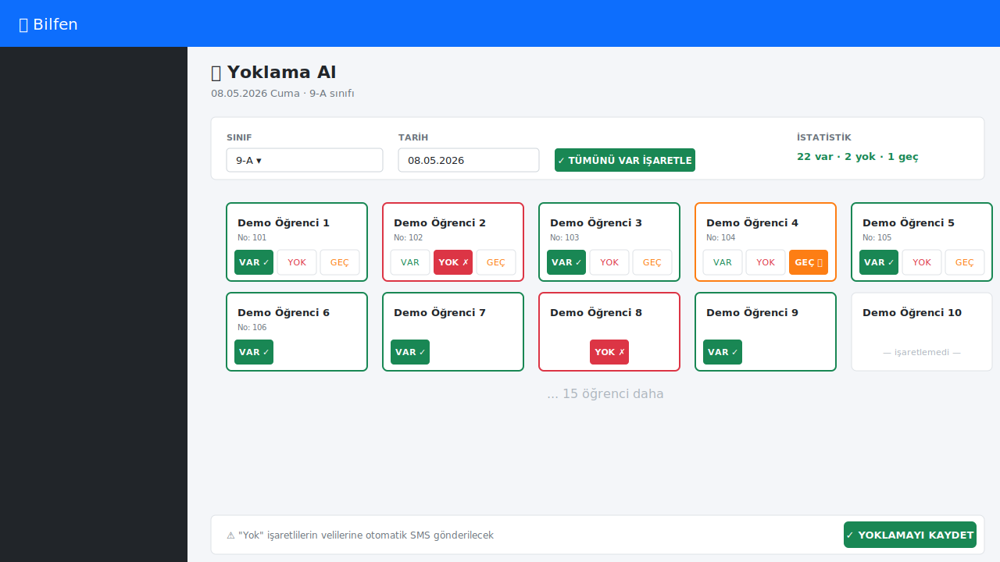
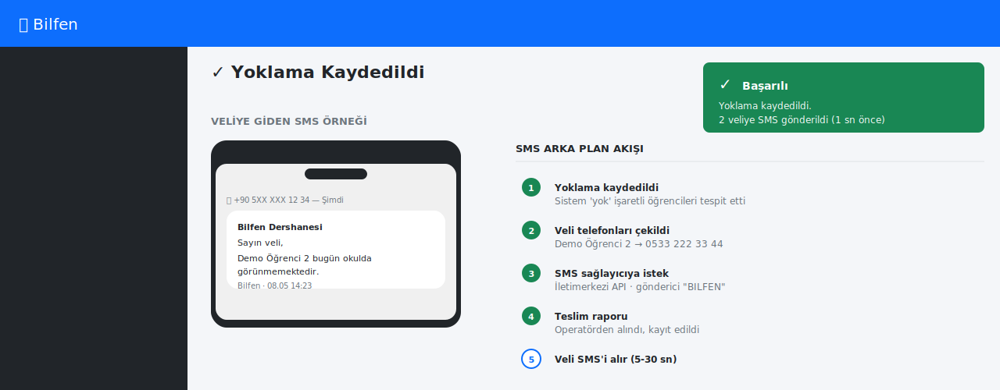
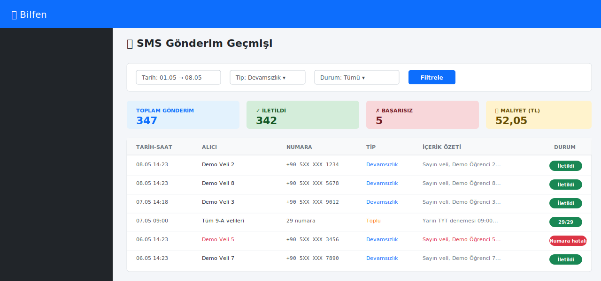
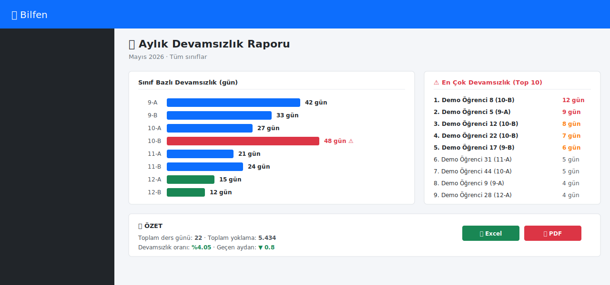

# 4. Devamsızlık ve Otomatik SMS

[← İçindekiler](00-index.md) · [← Önceki](03-ogrenci-kaydi.md)

## 4.1. Günün yoklamasını alma

Sol menü → **Devamsızlık → Yoklama Al**.

1. Üstten **sınıf** seç
2. Öğrenciler kart şeklinde dizilir
3. Her birine **"Var" / "Yok" / "Geç"** butonu
4. Hepsini "Var" yapmak istersen üstteki **"Tümünü Var İşaretle"** butonu
5. Tarihi değiştirmen gerekiyorsa üst form
6. **"Yoklamayı Kaydet"** butonu

## 4.2. Otomatik SMS gönderimi

Yoklama kaydedildikten sonra **arka planda otomatik**:
- Bugün okula gelmeyen ("yok" işaretli) öğrencilerin **velilerine SMS** gider
- Mesaj formatı: *"Sayın veli, [çocuk adı] bugün okulda görünmüyor."*

> ⚠️ SMS göndermek için sistem ayarlarında **SMS sağlayıcı**
> tanımlı olmalı (Sistem yöneticisi yapar). [Bölüm 10'a bakın](10-ayarlar-yetki.md).

## 4.3. Gönderim raporu

Her SMS'in nereye, ne zaman, hangi içerikle gittiği kayıt altında:

Veli "mesaj almadım" derse bu rapordan sorgulanabilir:
- Gönderim tarihi-saati
- Hedef numara
- Operatörden alınan teslim raporu

## 4.4. Geriye dönük yoklama düzenleme

Yanlış yazıldıysa:
1. **Devamsızlık → Geçmiş Yoklamalar**
2. Tarihe tıkla → o günün listesi açılır
3. Öğrencinin durumunu değiştir → Kaydet
4. **Yeniden SMS** gitmez (SMS sadece ilk kayıtta)

## 4.5. Aylık devamsızlık raporu

**Devamsızlık → Aylık Rapor** sayfasında:
- Sınıf bazlı toplam devamsızlık günü
- Öğrenci bazlı top 10 (en çok gelmeyenler)
- PDF/Excel dışa aktarım

## 4.6. Veliye toplu duyuru gönderme

Devamsızlık dışında veliye genel mesaj göndermek için:
- **Bildirim → Toplu Mesaj**
- Sınıf veya tüm dershane seç
- Mesajı yaz → Önizle → Gönder

> 💡 SMS maliyeti olduğu için **sadece kritik durumlar** için kullanın
> (sınav günü hatırlatma, kapanış, vs.).

---

[← İçindekiler](00-index.md) · [← Önceki](03-ogrenci-kaydi.md) · [Sonraki: Not Defteri →](05-not-karne.md)
