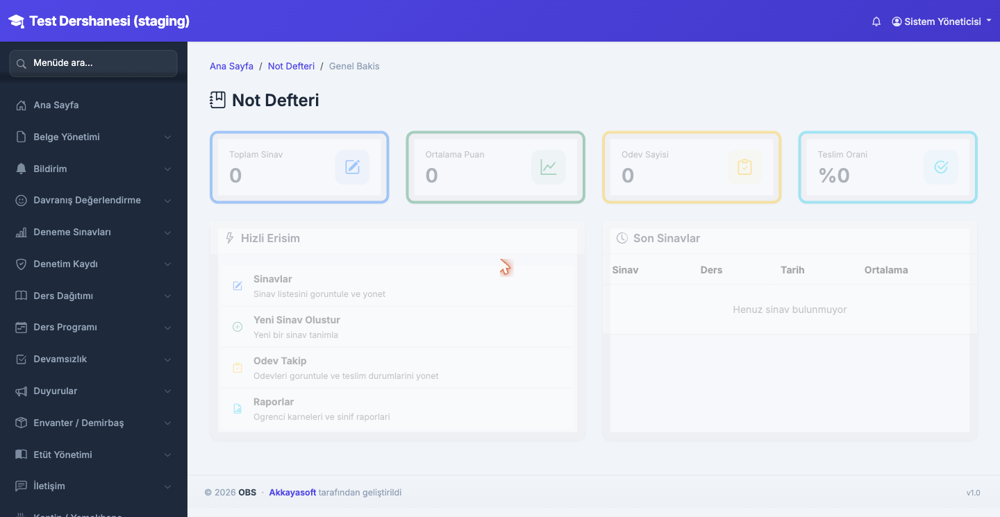
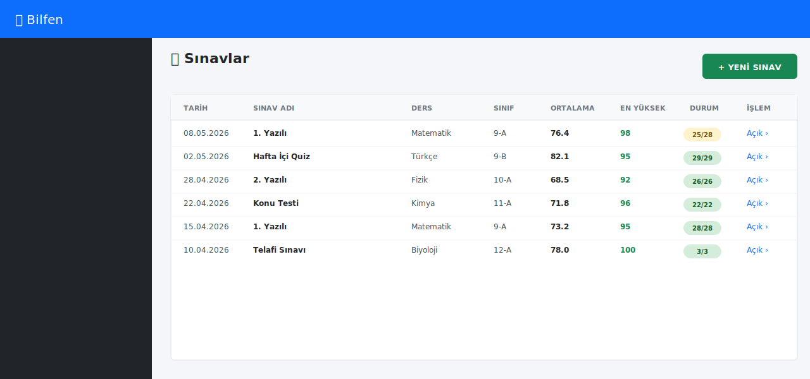
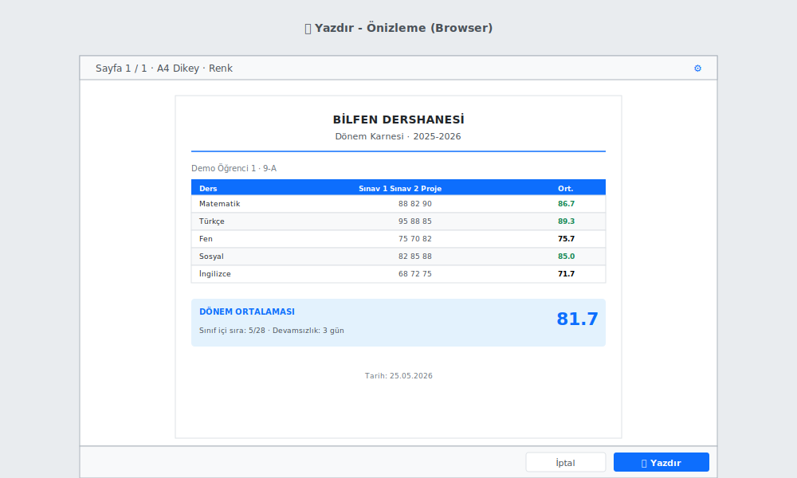
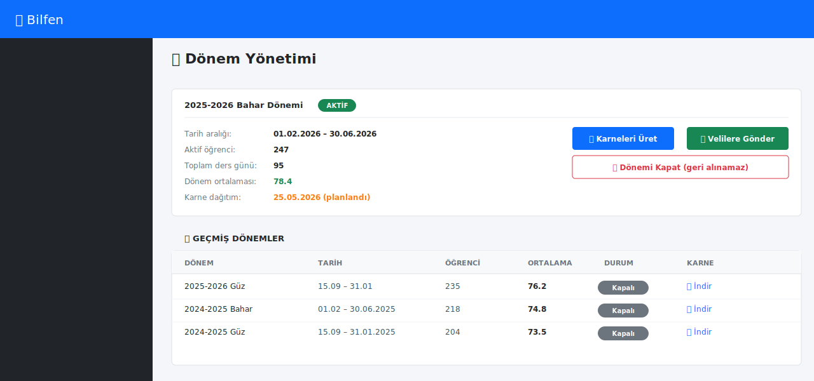
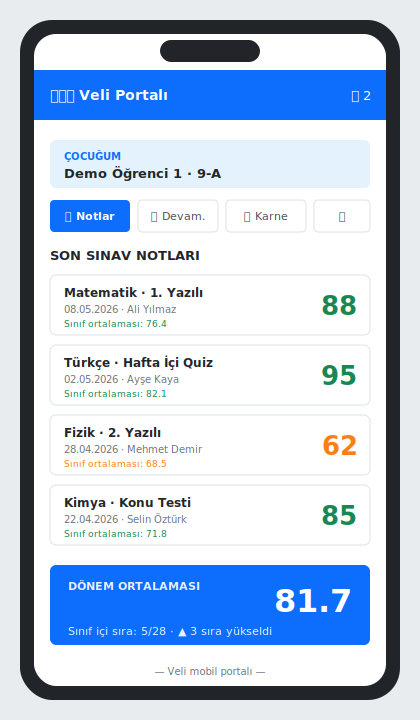

# 5. Not Defteri ve Karne

[← İçindekiler](00-index.md) · [← Önceki](04-devamsizlik.md)

## 5.1. Not girişi

**Not Defteri → Sınav Notları → Yeni Sınav** veya mevcut sınava tıklayarak.

1. Sınav adı (örn. "1. Yazılı — Matematik")
2. Tarih
3. Sınıf seç
4. Maksimum puan (varsayılan 100)
5. Tablo halinde her öğrenciye not gir
6. **Otomatik kaydet** — yazdıkça arka planda kaydedilir, "Kaydet" butonuna basmana gerek yok

> 💡 **Toplu giriş** modunda Tab ile bir sonraki kutuya geç, böylece
> mouse'a hiç dokunmadan tüm sınıfı geçebilirsin.

## 5.2. Sınav listesi ve düzenleme

**Not Defteri → Sınavlar** sayfasında bütün sınavlar listelenir.

- Sınava tıklayınca düzenleme açılır
- Sınıf ortalaması anında hesaplanır
- En yüksek/en düşük not vurgulanır

## 5.3. Karne / Transkript

**Karne → Öğrenci Seç** veya öğrenci detayından **Akademik → Karne**.

İçerik:
- Ders bazlı not listesi
- Sınıf ortalaması karşılaştırması
- Dönem ortalaması
- Devamsızlık özeti

### 5.3.1. Yazdırma / PDF

- Karne sayfasında **"Yazdır / PDF Olarak Kaydet"** butonu
- Yazıcıdan A4 dök, ya da PDF olarak indir
- @media print CSS ile çıktıda gereksiz öğeler (menü, butonlar) gizli

## 5.4. Karne dağıtım dönemi

- **Karne → Dönem Yönetimi** ile dönemi kapat
- Tüm sınıflara **PDF karne** otomatik gönderilebilir (veli portala düşer)
- E-posta ile veliye iletme: opsiyonel

## 5.5. Veli portalında not görme

Veli, çocuğunun girişiyle açılan portalda:
- **Notlar** sekmesinde son sınav notları
- **Karne** sekmesinde dönem karnesi
- **Devamsızlık** sekmesinde günlük durum

> Veliye ekstra mesaj göndermek gerekmiyor — kendi telefonuyla giriş
> yaptığında günlük takip edebiliyor.

---

[← İçindekiler](00-index.md) · [← Önceki](04-devamsizlik.md) · [Sonraki: Deneme Sınavı →](06-deneme-sinavi.md)
