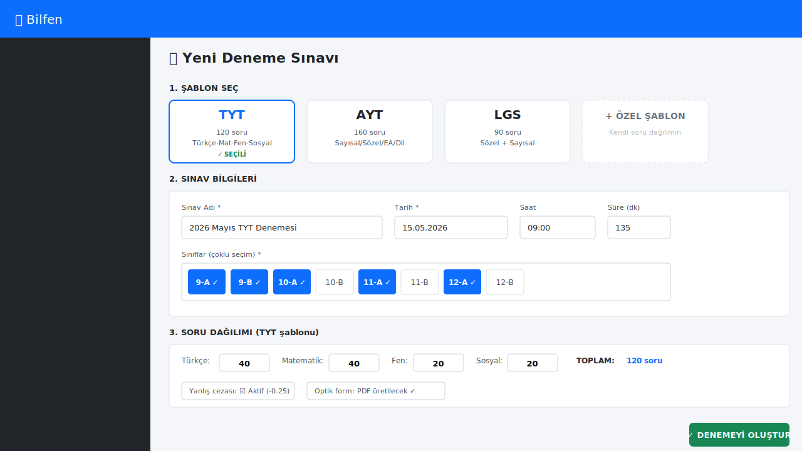
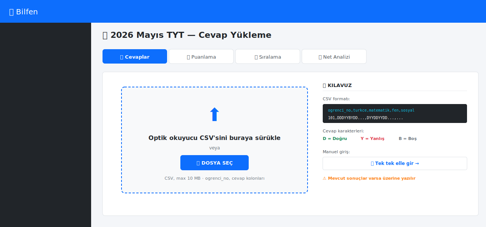
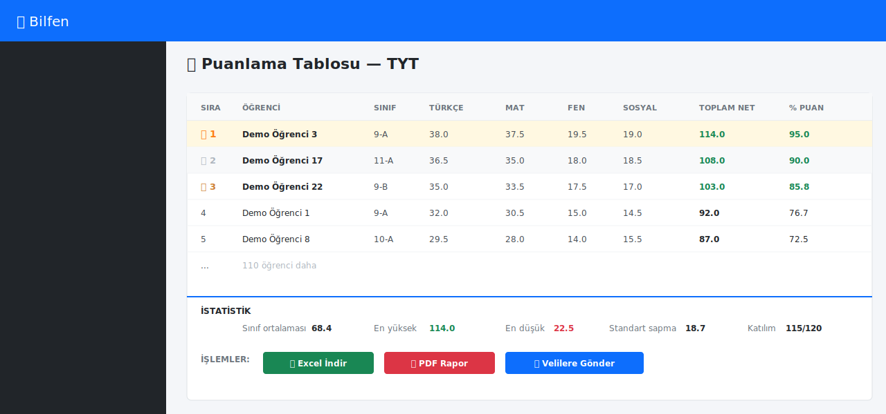
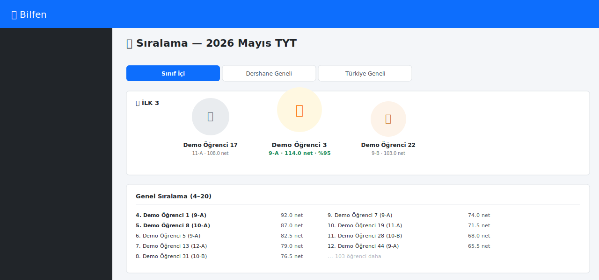
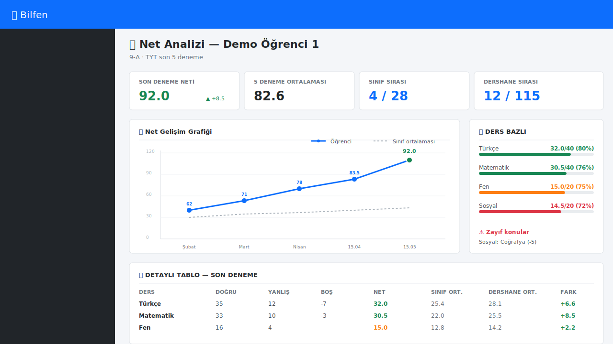
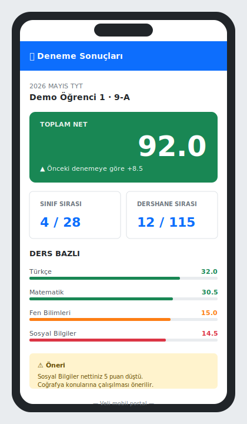
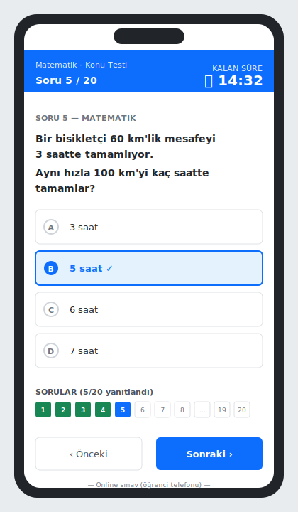

# 6. Deneme Sınavları

[← İçindekiler](00-index.md) · [← Önceki](05-not-karne.md)

Dershanenin kalbi: deneme sınavı yönetimi.

## 6.1. Yeni deneme oluşturma

Sol menü → **Deneme Sınavı → Yeni Deneme**.

1. **Şablon seç**: TYT / AYT / LGS
2. **Tarih**: deneme gün/saat
3. **Sınıf seç**: hangi sınıflar gireceği
4. **Ders soru sayısı**: matematik 40, türkçe 40 vs.
5. **Optik form**: PDF olarak otomatik üretilir → yazdır

## 6.2. Cevap kâğıtlarını sisteme yükleme

Sınav bittikten sonra:

**Deneme Sınavı → [denemeyi aç] → Cevaplar** sekmesi.

İki yol:
- **Optik okuyucu çıktısı (CSV)**: tek dosya yükle
- **Manuel giriş**: her öğrencinin doğru/yanlış sayısını gir

## 6.3. Otomatik puanlama ve net hesaplama

Sistem otomatik:
- Doğru × 1
- Yanlış × (-0.25 yanlış puanlama varsa)
- Net = doğru − (yanlış / 4)
- Ders bazlı netleri hesaplar
- Toplam net + yüzde / sıra üretir

## 6.4. Sıralama tablosu

**Deneme detayı → Sıralama** sekmesi:

- Sınıf içi sıra
- Dershane geneli sıra
- Türkiye geneli (varsa karşılaştırma için ortalama veri)

## 6.5. Öğrenci net analizi

Her öğrencinin kendi sayfasında:

- Ders bazlı doğru/yanlış/boş sayısı
- Son 5 denemede net trendi (line chart)
- Zayıf konular tespiti (varsa konu bazlı analiz)

## 6.6. Veli portalında deneme sonucu

Veli, çocuğunun deneme sonuçlarını otomatik görür:

- Net + sıralama
- Önceki denemelere göre değişim (↑ ↓)
- Gelişim grafiği

## 6.7. Online Sınav

Sınıf içi quiz veya konu testi için:

**Online Sınav → Yeni Sınav** ile öğretmen kendi soru bankasından
çoktan seçmeli sınav oluşturur. Öğrencilere link gönderilir, kendi
telefonlarından girerler.

> 💡 Online sınav otomatik puanlama yapar; sonuçlar Not Defteri'ne
> tek tıkla aktarılabilir.

---

[← İçindekiler](00-index.md) · [← Önceki](05-not-karne.md) · [Sonraki: Muhasebe →](07-muhasebe.md)
