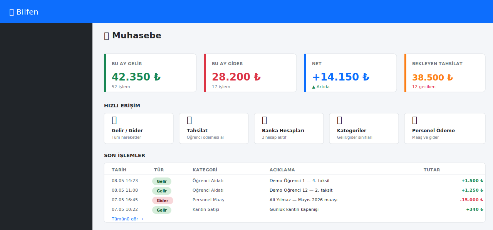
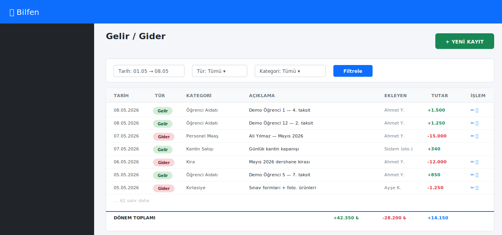
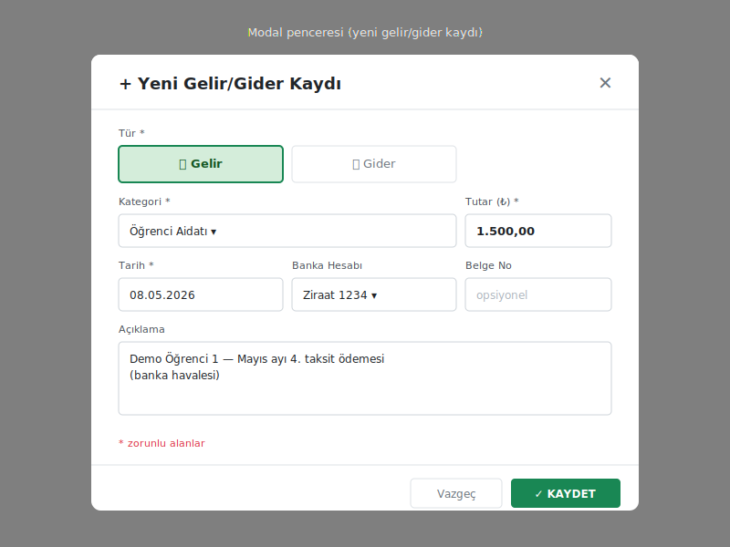
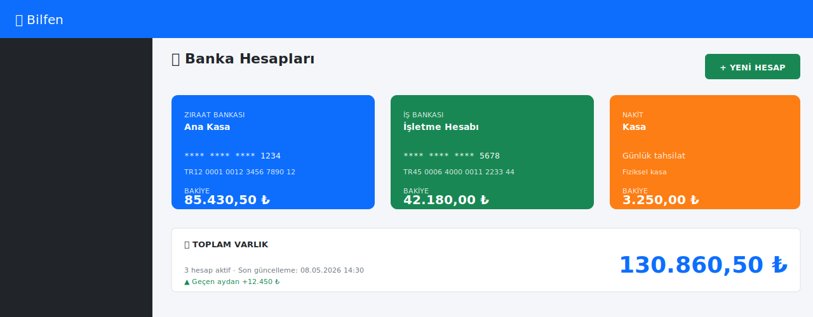
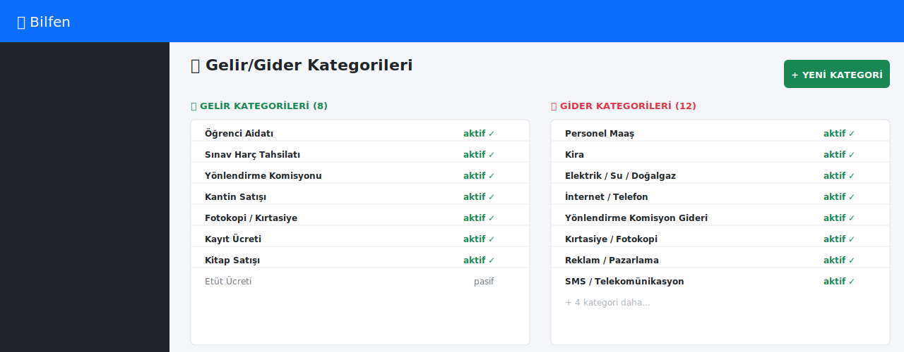
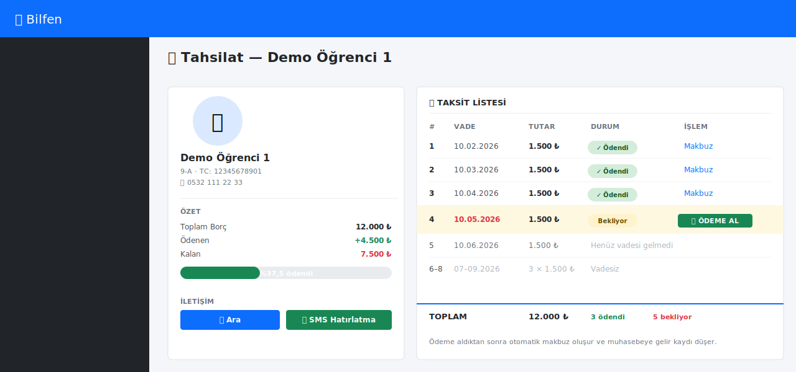
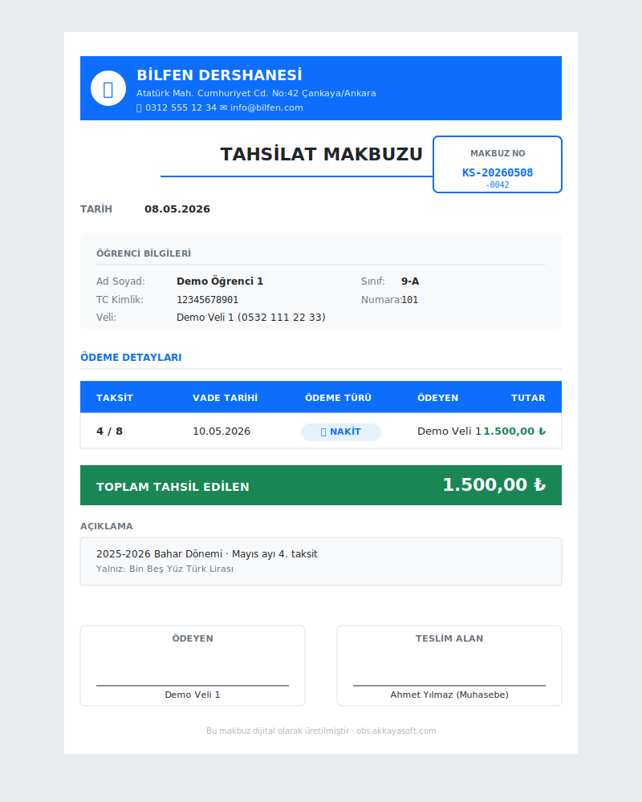
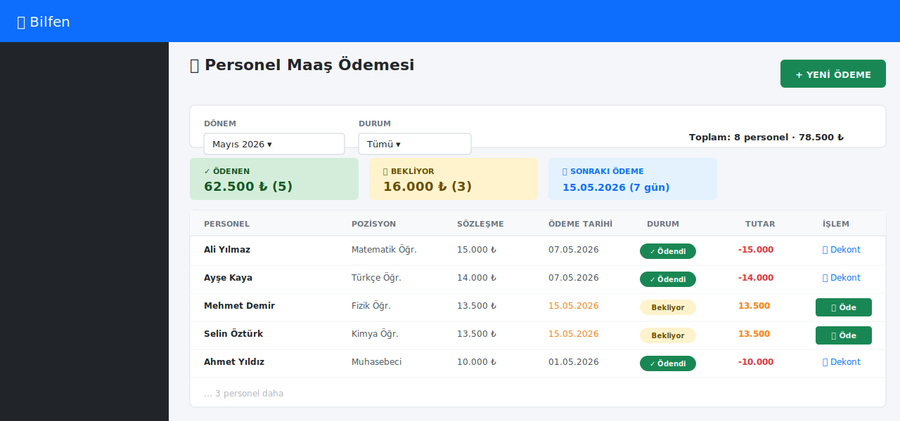

# 7. Muhasebe (Gelir/Gider, Tahsilat)

[← İçindekiler](00-index.md) · [← Önceki](06-deneme-sinavi.md)

## 7.1. Muhasebe ana sayfası

Sol menü → **Muhasebe**.

KPI kartları:
- Bu ay gelir / gider / **net**
- Bekleyen taksit toplamı
- Personel maaş ödemesi durumu

## 7.2. Gelir/Gider Listesi

**Muhasebe → Gelir / Gider** sayfasında tüm hareketler:

Kolonlar:
- Tarih
- Tür (Gelir 🟢 / Gider 🔴 badge)
- Kategori (Aidat, Kantin, Maaş, Kira, ...)
- Açıklama, belge no
- Tutar
- **Ekleyen** (kullanıcı + tarih/saat)
- Düzenle / Sil

## 7.3. Manuel gelir/gider ekleme

Sağ üst **"Yeni Kayıt"** butonu.

| Alan | Notlar |
|---|---|
| Tür | Gelir / Gider |
| Kategori | Önceden tanımlı listeden seç |
| Tutar | ₺ değeri |
| Tarih | Geçmiş ya da bugün (gelecek değil) |
| Banka Hesabı | Hangi hesaba/kasaya yansıyacak (opsiyonel) |
| Açıklama | Serbest metin |
| Belge No | Fatura/makbuz no |

## 7.4. Otomatik kayıtlar

Sistem aşağıdaki işlemler için **otomatik gelir/gider kaydı oluşturur**:

| İşlem | Otomatik kayıt |
|---|---|
| Öğrenci taksiti tahsil edilir | Gelir → "Öğrenci Aidatı" |
| Sürücü kursu kursiyer taksiti | Gelir → "Sürücü Kursu Geliri" |
| Sınav harç tahsilatı | Gelir → "Sınav Harç Tahsilatı" |
| Yönlendirme komisyonu alındı | Gelir → "Yönlendirme Komisyonu" |
| Personel maaş ödemesi | Gider → "Personel Maaş" |
| Komisyon ödemesi (bize gelen) | Gider → "Yönlendirme Komisyon Gideri" |
| Kantin satışı | Gelir → "Kantin Satışı" |

> 💡 Bu kayıtlar **geri alınabilir** — ilgili ödeme/tahsilatı iptal
> ettiğinizde otomatik gelir/gider kaydı da silinir.

## 7.5. Banka Hesapları

**Muhasebe → Banka Hesapları**:

- Birden fazla banka hesabı / kasa tanımlanabilir
- Her gelir/gider hareketinde hesap seçimi var
- Hesap bazında **ay sonu mizan** alınabilir

## 7.6. Kategoriler

**Muhasebe → Kategoriler** ile gelir-gider kategorileri yönetilir.

> Sistem ilk kurulumda standart kategorileri açar (Aidat, Maaş, Kira,
> Kırtasiye vb.); ek kategori eklemek mümkün.

## 7.7. Öğrenci Ödemesi (Tahsilat)

**Muhasebe → Tahsilat** veya öğrenci detayında **Muhasebe** sekmesi.

1. Öğrenciyi seç (otomatik tamamlama)
2. Hangi taksit?
3. **Ödeme türü** (Nakit / EFT / Kredi Kartı)
4. **Ödeyen kişi** (boşsa öğrencinin adı)
5. **Tarih** (bugün ya da geçmiş)
6. **Onayla** → makbuz oluşur, otomatik gelir kaydı düşer

### 7.7.1. Makbuz görüntüleme/yazdırma

Tahsilat sonrası A4 makbuz açılır:

İçerik:
- Dershane adı + logo (üst)
- Makbuz no (KS-YYYYMMDD-NNNN)
- Öğrenci kimlik bilgileri
- Ödeme detayı (taksit no, vade, tutar, tür)
- İmza alanları (ödeyen / teslim alan)

> Aynı makbuz daha sonra makbuz arama sayfasından (KSnoyla)
> tekrar açılıp yazdırılabilir.

## 7.8. Personel Maaş Ödemesi

**Muhasebe → Personel Ödeme**:

1. Personel seç
2. Dönem (örn. "Mayıs 2026 maaşı")
3. Tutar (sözleşmeden otomatik)
4. Banka hesabı
5. Ödeme tarihi
6. Onayla → otomatik **gider kaydı**

---

[← İçindekiler](00-index.md) · [← Önceki](06-deneme-sinavi.md) · [Sonraki: Raporlar →](08-raporlar.md)
