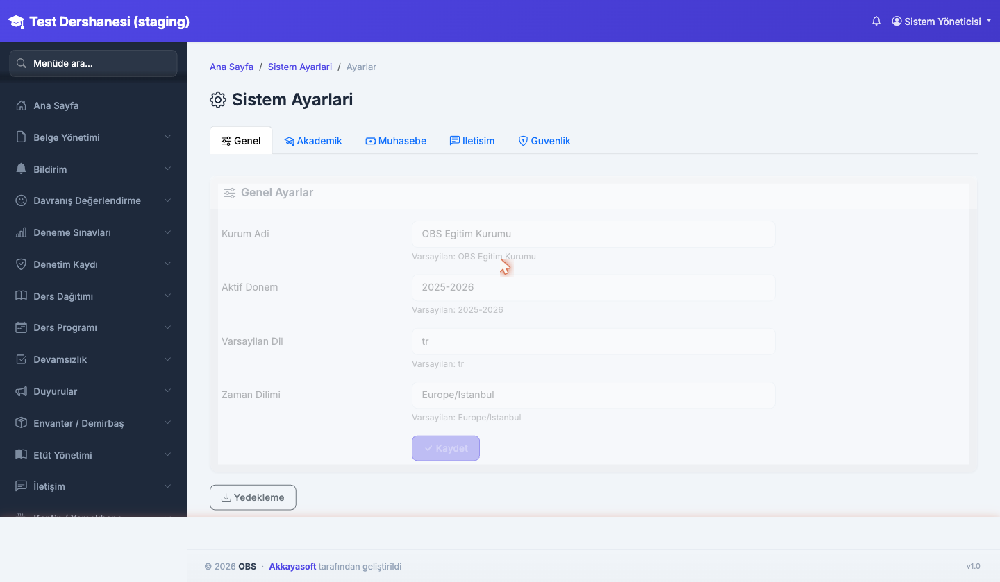
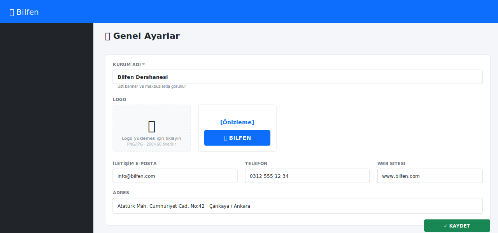
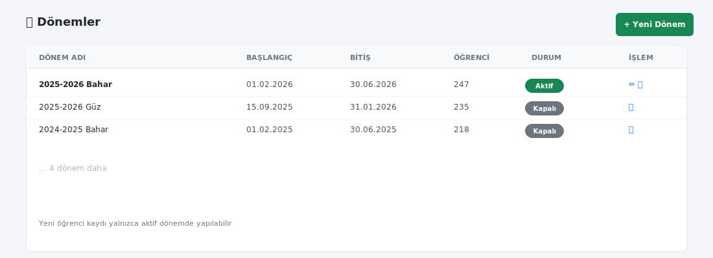
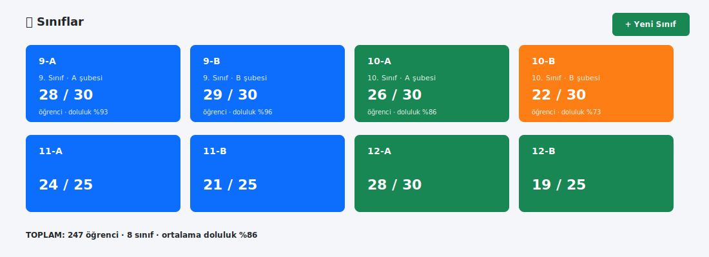
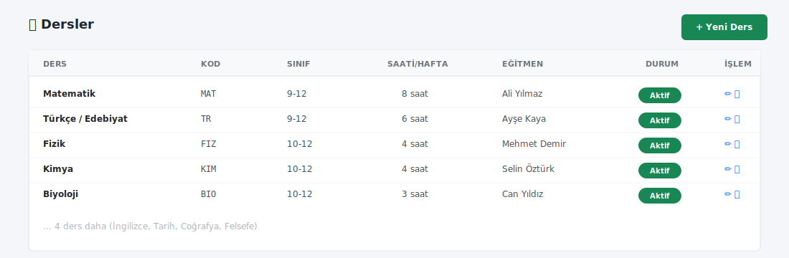
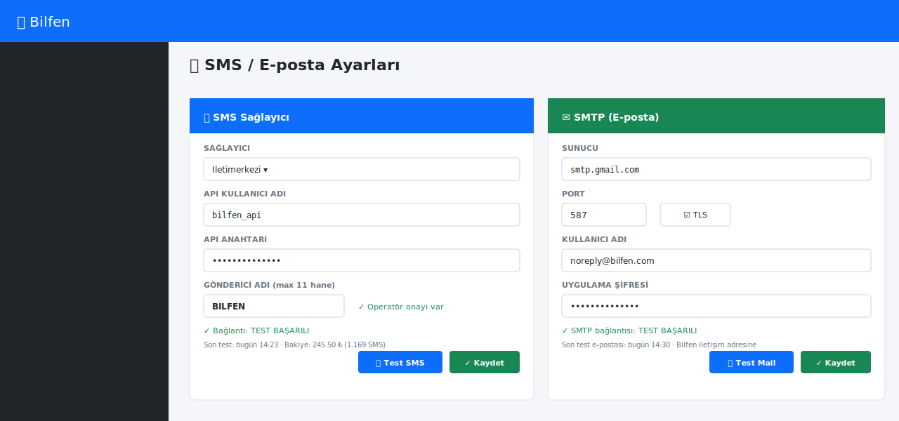
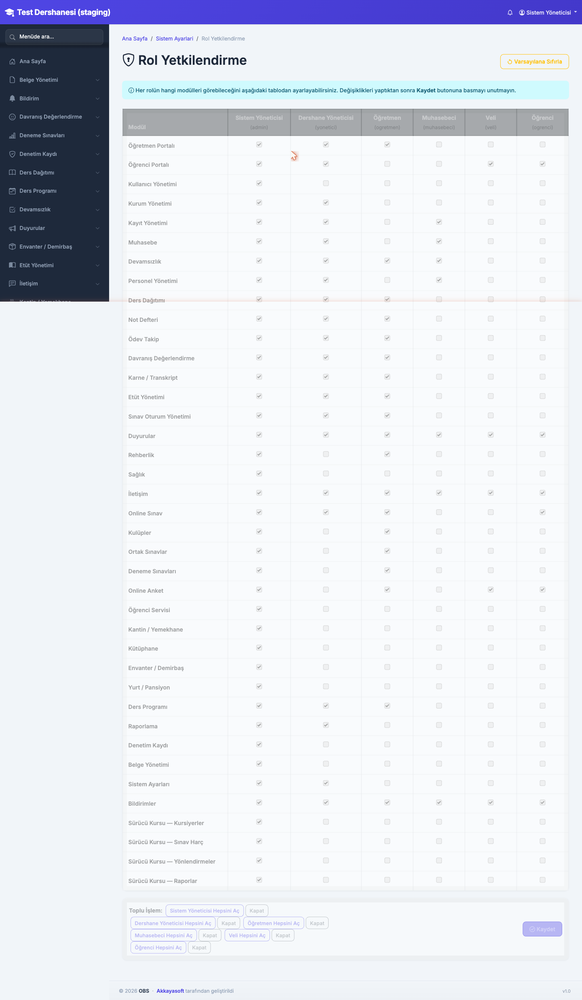
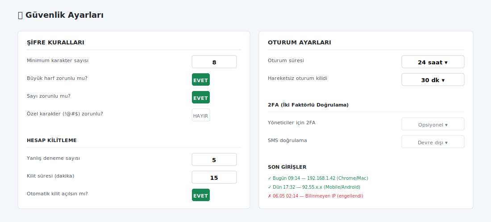
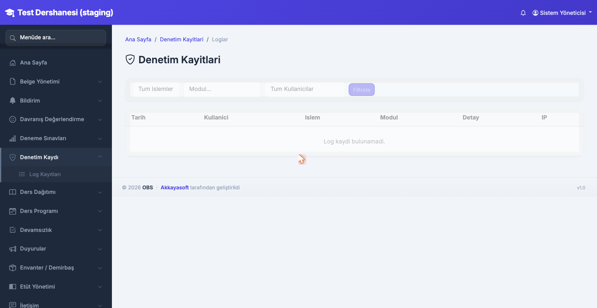
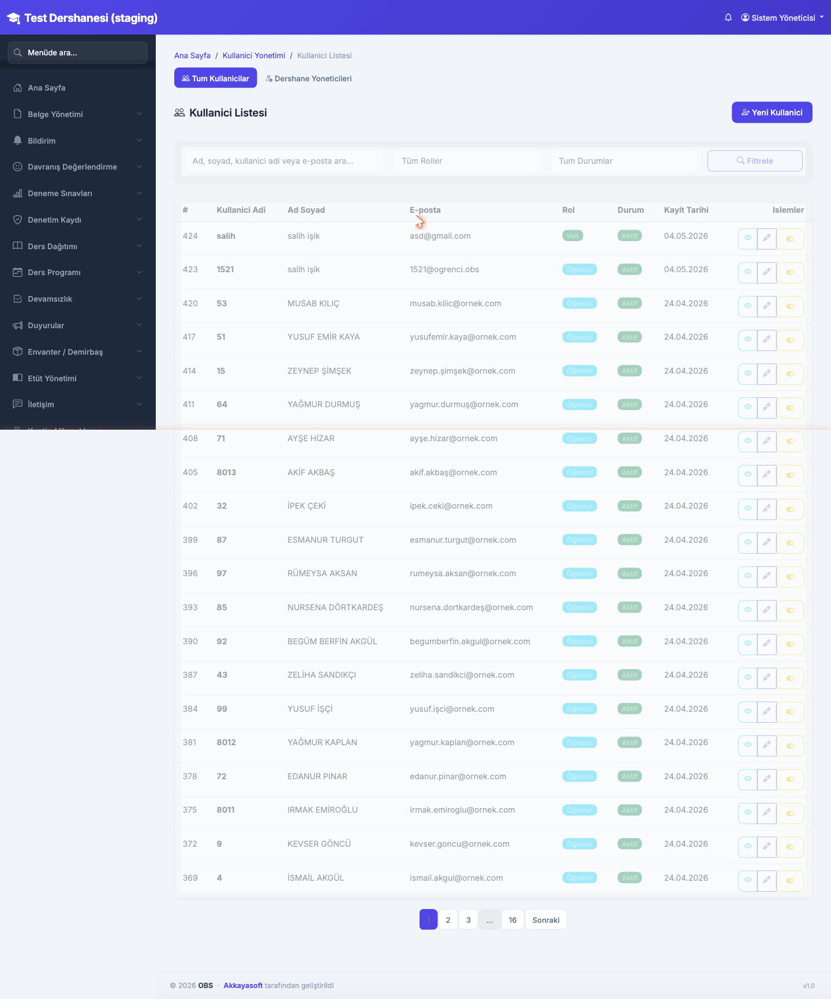

# 10. Sistem Ayarları ve Yetkilendirme

[← İçindekiler](00-index.md) · [← Önceki](09-bildirim.md)

> ⚠️ Bu bölüm yalnızca **Sistem Yöneticisi** ve **Yönetici** rolleri
> tarafından görülür. Yönetici artık admin ile eşit yetkilere sahiptir.

## 10.1. Ayarlar ana sayfası

Sol menü → **Sistem Ayarları**.

Bölümler:
- **Genel**: kurum adı, logo, iletişim
- **Akademik**: dönem, sınıf, ders tanımları
- **Muhasebe**: kategori, banka hesabı
- **İletişim**: SMS / e-posta sağlayıcı
- **Güvenlik**: şifre kuralı, oturum süresi
- **Yedekleme**: DB yedek al/geri yükle
- **Yetkilendirme**: rol-modül izin matrisi

## 10.2. Genel ayarlar

| Alan | Notlar |
|---|---|
| Kurum Adı | Üst navbar ve makbuzlarda görünür |
| Logo | PNG/JPG, ideal 200×60 |
| İletişim e-posta / telefon | Otomatik mailler bu adresten gider |
| Adres | Makbuz ayağında basılır |

## 10.3. Akademik tanımlar

### Dönemler
 — "2026-2027 Güz", tarih aralığı, aktif/pasif

### Sınıflar
 — Sınıf adı (9-A), seviye, kapasite

### Dersler
 — Matematik, Türkçe, Fen, ...

## 10.4. SMS / E-posta sağlayıcı

**Ayarlar → İletişim**:

### SMS
- Sağlayıcı seç (Iletimerkezi, NetGSM, Mutlu Cep, ...)
- API kullanıcı adı + API anahtarı
- Gönderici adı (kurumun onaylı başlığı, max 11 karakter)
- **"Test Mesajı Gönder"** butonu ile doğrulama

### E-posta (SMTP)
- Sunucu (smtp.gmail.com vb.)
- Port (587 / 465)
- Kullanıcı + şifre / app password
- TLS/SSL
- **"Test E-postası Gönder"** ile doğrulama

> 💡 Gmail kullanırken **2FA + uygulama şifresi** zorunludur.

## 10.5. Yetkilendirme matrisi

**Ayarlar → Yetkilendirme**:

- Satırlar: modüller (Muhasebe, Devamsızlık, Not Defteri, ...)
- Sütunlar: roller (Sistem Yöneticisi, Yönetici, Öğretmen, Muhasebeci, Veli, Öğrenci)
- Her hücre bir checkbox: işaretliyse o rol o modülü görür

> **Sistem Yöneticisi sütunu kilitli** — her zaman tüm modülleri görür.

### Pratik kullanım
- Öğretmenden Muhasebe'yi gizlemek istediğinde: Muhasebe satırı, Öğretmen sütunu → uncheck
- Veliye sadece kendi çocuğunun bilgileri (Öğrenci Portalı) → uncheck diğerleri

## 10.6. Güvenlik ayarları

- Şifre minimum karakter (varsayılan 6)
- Yanlış girişte hesap kilitleme (5 hatalı denemede 15 dk kilit)
- Oturum zaman aşımı (varsayılan 24 saat)
- 2FA (opsiyonel)

## 10.7. Denetim Kaydı (Audit Log)

Sistemde yapılan kritik işlemlerin geçmişi:
- Kim, ne zaman, hangi işlemi yaptı
- Tenant oluşturma, silme, askıya alma
- Şifre değişimi, kullanıcı oluşturma
- Yedek alma / geri yükleme

> 6 ay arşivlenmesi tavsiyye edilir.

## 10.8. Kullanıcı Yönetimi

**Sol menü → Kullanıcı Yönetimi**:

- Tüm kullanıcılar listesi (rol, son giriş, durum)
- **Yeni Kullanıcı**: ad, email, rol, geçici şifre
- **Düzenle**: rol değiştir, kilidi aç, şifre sıfırla
- **Pasif et**: girişi engelle (sil yerine)

---

[← İçindekiler](00-index.md) · [← Önceki](09-bildirim.md) · [Sonraki: Yedekleme →](11-yedekleme.md)
